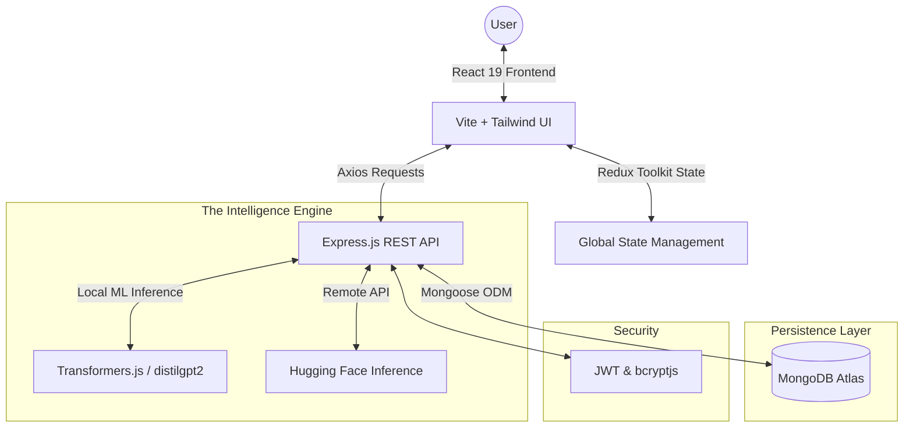

# 🛍️ ShopGo — Autonomous Marketplace Engine

     

🚀 **ShopGo** is a next-generation, self-sustaining e-commerce ecosystem. It moves beyond traditional shopping carts by integrating a **State-of-the-Art Autonomous Intelligence Layer** that handles customer intent, real-time product recommendations, and automated order management.

✨ [Features](#-features) • 🧠 [AI Logic](#-core-intelligence) • 🛠 [Tech Stack](#-tech-stack) • 📐 [Architecture](#-architecture) • 🚀 [Getting Started](#-getting-started)

---

## 🎯 Project Vision
To bridge the gap between "dumb" catalogs and personalized retail. ShopGo utilizes **On-Device Machine Learning** and **Modular Backend Services** to provide a seamless, secure, and intelligent shopping experience that requires minimal human intervention for support and discovery.

---

## ✨ Features

### 🛍️ Autonomous Catalog & Discovery
*   **Dynamic Intelligence** — Local `distilgpt2` model classifies user intent in real-time.
*   **Smart Categorization** — Massive support for Electronics, Sports, Home, Books, Clothing, and Accessories.
*   **Context-Aware Search** — Filters products based on natural language queries.

### 🤖 Core Intelligence (AI Assistant)
*   **Greet & Identify** — Warmly greets users and clarifies their specific needs (budget, use case).
*   **Intelligent Recommendations** — provides curated "Best Fit" matches with links.
*   **Seamless Upselling** — Suggests complementary products based on cart and browsing history.
*   **Autonomous Support** — Pulls real-time data from the Order Management System (OMS).
*   **Human-in-the-Loop Escalation** — Automatically transfers to human agents upon detecting user frustration.

### 💳 Cart, Checkout & Orders
*   **Persistence Layers** — Stateful cart management via Redux Toolkit with persistent session logic.
*   **Safe Checkout** — Streamlined verification and simulated payment gateways.
*   **Global Dashboard** — Manage profiles, track order history, and monitor real-time shipment status.

---

## 📐 Architecture



---

## 🛠 Tech Stack

### 📱 Frontend (The Interface)
| Technology | Description |
|------------|-------------|
| **React 19** | Core UI library for high-speed rendering. |
| **Vite 7** | Modern build tool for blazingly fast development. |
| **Redux Toolkit** | Centralized state for Carts, Auth, and Chat. |
| **Tailwind CSS 4** | Ultra-scalable utility-first design system. |
| **React Router 7** | Dynamic client-side navigation. |

### ⚙️ Backend (The Engine)
| Technology | Description |
|------------|-------------|
| **Node.js** | High-performance asynchronous runtime. |
| **Express.js 5** | Robust RESTful API architecture. |
| **MongoDB 7** | Scalable NoSQL persistence. |
| **Transformers.js** | On-device ML for lower latency AI interactions. |

---

## 🔗 API Reference

### 👤 Authentication & Users
| Endpoint | Method | Purpose |
|----------|--------|---------|
| `/api/user/signup` | POST | Register a new consumer account. |
| `/api/user/login` | POST | Secure JWT-based authentication. |
| `/api/user/logout` | GET | Session termination. |
| `/api/user/check-auth` | GET | Validate session status. |

### 🎁 Product Management
| Endpoint | Method | Purpose |
|----------|--------|---------|
| `/api/products` | GET | Fetch the entire autonomous catalog. |
| `/api/products` | POST | **[Admin]** Add a new product listing. |
| `/api/products/:id` | GET | Detailed product view. |
| `/api/products/:id` | DELETE | **[Admin]** Remove product from catalog. |

### 🛒 Cart & Order Flow
| Endpoint | Method | Purpose |
|----------|--------|---------|
| `/api/cart` | GET | Retrieve user-specific shopping cart. |
| `/api/cart` | POST | Add or sync items to the cart. |
| `/api/orders` | POST | Finalize checkout and create order. |
| `/api/orders/:id` | GET | Real-time status of a specific order. |

### 🧠 Intelligence
| Endpoint | Method | Purpose |
|----------|--------|---------|
| `/api/chatbot/message` | POST | Process messages via AI Engine. |

---

## 🚀 Getting Started

### 1️⃣ Clone and Prepare
```bash
git clone <repository-url>
cd mern
```

### 2️⃣ Configure Environments
Create a `.env` in the `backend/` directory:
```env
MONGO_URI=your_mongodb_connection_string
JWT_SECRET=your_ultra_secure_key
PORT=5000
HUGGINGFACE_API_KEY=optional_cloud_inference_key
```

### 3️⃣ Installation & Boot
**Backend:**
```bash
cd backend
npm install
npm run dev
```

**Frontend:**
```bash
cd frontend_new
npm install
npm run dev
```

---

## 📊 Data Schema Overview

*   **Users**: Unified credentials, role-based access tokens (Admin/User), and order history references.
*   **Products**: Schema includes `category`, `stockCount`, `rating`, and AI-optimizable descriptors.
*   **Orders**: State-tracked (Pending, Shipped, Delivered) with full product snapshot links.
*   **Cart**: Aggregated collection mapped to User sessions for cross-device consistency.

---

## 🤝 Contributing
We welcome contributions to the **ShopGo Engine**!
1. Fork the repo.
2. Create your `feature/amazing-feature` branch.
3. Commit and open a PR.

## 📄 License
Licensed under the **ISC License**.

---

🌟 _Built with ❤️ for the next generation of autonomous retail._

[⬆ Back to Top](#-shopgo--autonomous-marketplace-engine)
